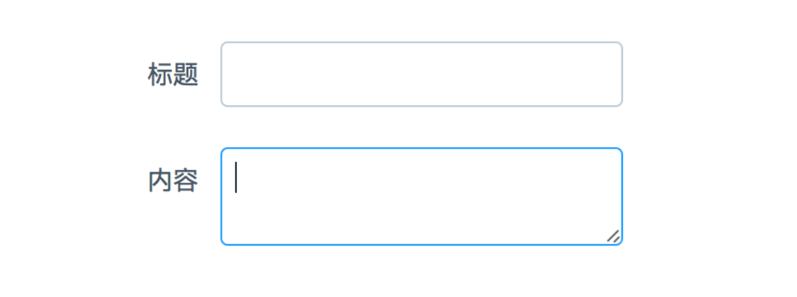
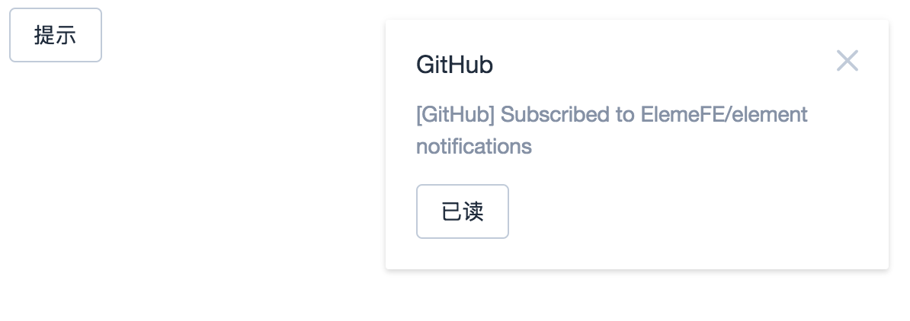

# Vue.js 实用技巧：代码片段

## template + render function

在写 Vue 模板时，有时会遇到不得不手写 `render function` 的情况。如需要根据 prop 更改布局——[Element 分页组件](https://github.com/ElemeFE/element/blob/dev/packages/pagination/src/pagination.js)——或者根据 prop 判断生成指定标签。

比如我们想实现 Element 里的 input 组件的用法。

```html
<field label="标题" type="input" />
<field label="内容" type="textarea" />
```

会渲染出一个 input 和 textarea：



那么我们用 Vue 模板写就需要用根据 `type` 判断当前渲染哪个组件。

```html
<template>
  <div>
    <label>{{ label }}</label>

    <input v-if="type !== 'textarea'" :type="type">
    <textarea v-else></textarea>
  </div>
</template>

<script>
  export default {
    name: 'field',

    props: ['type', 'label']
  }
</script>
```

如果我们还需要传原生组件上的属性，例如 `placeholder`、`name`、`disabled` 以及各种校验属性和事件，那么重复代码就会非常多。但是如果我们用 jsx 写 render function 就会容易许多且代码也会更清晰。

```js
export default {
  name: 'field',

  props: ['type', 'label'],

  render (h) {
    const tag = this.type === 'textarea' ? 'textarea' : 'input'
    const type = this.type === 'textarea' ? '' : this.type

    return (
      <div>
        <label>{ this.label }</label>
        { h(tag, { props: { type } }) }
      </div>
    )
  }
}
```

可是如果组件再复杂一些，需要加入表单验证的错误提示或者一些 icon 等内容，那么写模板就比写 render function 更容易阅读。那我们是否可以将两种方式结合起来？

在 Vue 里有一个强大的特性：Slots —— 给组件设置一个特殊的 slot 组件，让使用者可以传入自定义的模板内容。但是在实际使用中，我发现其实是可以给 slot 赋值的。举个例子，还是用上面的例子，假设 label 部分我们想写成模板，input 的部分根据 type 生成特性的内容。那么我们模板可以写成：

```html
<template>
  <div>
    <label>{{ label }}</label>
    <slot></slot>
  </div>
</template>
```

input 部分用 slot 代替，但是并不是让使用者自己定义，而是我们给这个 slot 赋值。

```html
<script>
  export default {
    name: 'field',

    props: ['type', 'label'],

    created() {
      this.$slots.default = [ this.renderField() ]
    },

    methods: {
      renderField() {
        const h = this.$createElement
        const tag = this.type === 'textarea' ? 'textarea' : 'input'
        const type = this.type === 'textarea' ? '' : this.type

        return h(tag, { props: { type } })
      }
    }
  }
</script>
```

其中 `renderField` 就是我们手写的 render function，在组件 `created` 时调用并赋值给 `this.$slots.default`。意思就是我们用手写的 vnode 强制替换掉了 `$slots.default` 的 vnode，从而达到 template 和 render function 结合的目的。

但是这有个问题，这么做我们就破坏了 slot 的更新规则。看过源码可以知道 slots 是在[父组件 vdom 更新时才更新的 slots](https://github.com/vuejs/vue/blob/v2.2.0-beta.2/dist/vue.runtime.common.js#L1949)，也就是说我们没法再组件内部触发 `renderField` 的执行，除非用 watch，但是需要 watch 的 prop 多的话也很麻烦。

所以如果你只是需要在初始化时（created）用这种方式渲染组件，并且明白它的限制，其实还是可以使用，而且某些场景下会带来特别的效果。例如 Element 的 notification 服务，通过 `this.$notify` 传入一段内容可以显示一个消息提醒。其实我么还可以传入一段 vdom 来显示一段自定义内容。[在线例子](http://jsfiddle.net/78yk3tc4/)

```js
const h = this.$createElement

this.$notify({
  title: 'GitHub',
  message: h('div', [
    h('p', '[GitHub] Subscribed to ElemeFE/element notifications'),
    h('el-button', {}, '已读')
  ])
})
```



## jsx

如果你对 vdom 不熟悉，觉得上面例子写起来很费劲，那么其实你也可以写 jsx 的。如果你了解过 Vue jsx 的写法就会知道我们每次都需要在 render 方法中写一个 `h` 的参数，即使我们并没有直接用到，只是给  [babel-plugin-transform-vue-jsx](https://github.com/vuejs/babel-plugin-transform-vue-jsx) 编译后用的。例如

```js
render: function (h) {
  return <div>23333</div>
}
```

会被插件编译成

```js
render: function(h) {
  return h('div', {}, '23333')
}
```

那个 h 其实就等价于 `this.$createElement`——创建 vnode 用的。那么其实我们就可以用这个特性，声明一下 `h` 给 babel 插件使用，把上面的例子改写成 jsx：

```js
const h = this.$createElement

this.$notify({
  title: 'GitHub',
  message: (<div>
            	<p>[GitHub] Subscribed to ElemeFE/element notification</p>
            	<el-button>已读<el-button>
            <div>)
})
```

如果有 eslint 的话，给第一行加上 `// eslint-disable-line` 就好了。

## $props

在开发通用的 field 组件时，经常会遇到需要继承原生属性的需求。例如需要加上 placeholder 时，我们的代码可能是这样：

```html
<template>
  <div>
    <label>{{ label }}</label>

    <input
      :type="type"
      :placeholder="placeholder">
  </div>
</template>

<script>
  export default {
    props: ['label', 'placeholder']
  }
</script>
```

但是随着需求越来越多，我们就要不断的拓展原生属性，可能就要变成这样

```html
<template>
  <div>
    <label>{{ label }}</label>

    <input
      :type="type"
      :placeholder="placeholder"
      :maxlength="maxlength"
      :minlength="minlength"
      :name="name"
      :form="form"
      :value="value"
      :disabled="disabled"
      :readonly="readonly"
      :autofocus="autofocus">
  </div>
</template>

<script>
  export default {
    name: 'field',

    props: ['label', 'type', 'placeholder',
    'maxlength', 'minlength', 'name', 'form',
    'value', 'disabled', 'readonly', 'autofocus']
  }
</script>
```

假设还要包含 textarea 组件，那重复的代码还是挺多的。如果我们换个思路，用 jsx 写。了解 vnode 的结构的话，会知道原生属性是定义在 `data.attrs` 上的，组件的属性是在 `data.props` 上。这里我们是给原生 input 传属性。只需要把使用者传来的值包装成一个对象：

```js
export default {
  props: ['label', 'type', 'placeholder',
  'maxlength', 'minlength', 'name', 'form',
  'value', 'disabled', 'readonly', 'autofocus'],

  render(h) {
    const attrs = {
      placeholder: this.placeholder,
      type: this.type
      // ...
    }

    return (
      <div>
        <label>{ this.label }</label>
        <input { ...{ attrs } } />
      </div>
    )
  }
}
```

这么做还是需要写许多重复代码，那能不能直接从组件实例上获取到使用者传进来的 props 呢。在 `vue@2.1.10` 之前我们还做不到，并没有一个特殊的字段存 props，但是我们可以自己加一个 polyfill。

```js
import Vue from 'vue'

Object.defineProperty(Vue.prototype, '$props', {
  get () {
    var result = {}
    for (var key in this.$options.props) {
      result[key] = this[key]
    }
    return result
  }
})
```

从 `this` 上获取属于 props 的数据并定义为 `$props`，这样我们的代码就可以更简洁。

```js
export default {
  props: ['label', 'type', 'placeholder',
  'maxlength', 'minlength', 'name', 'form',
  'value', 'disabled', 'readonly', 'autofocus'],

  render(h) {
    return (
      <div>
        <label>{ this.label }</label>
        <input { ...{ attrs: this.$props } } />
      </div>
    )
  }
}
```

如果留意过 Vue 的文档，或许会看到 [`v-bind`](http://vuejs.org/v2/api/#v-bind) 是可以传对象的，那么我们可以把代码改成 vue 模板。

```html
<template>
  <div>
    <label>{{ label }}</label>
    <input v-bind="$props">
  </div>
</template>

<script>
  export default {
    props: ['label', 'type', 'placeholder',
    'maxlength', 'minlength', 'name', 'form',
    'value', 'disabled', 'readonly', 'autofocus']
  }
</script>

```

`$props` 的功能不止如此，如果你需要开发一个继承上面 field 组件的另一个组件，假设我们要扩展一个带校验提示的 field 组件，只是在原有组件上加上校验逻辑和提示：

```html
<template>
  <div>
    <field></field>
    <div class="tip">{{ hit }}</div>
  </div>
</template>
```

那么同样的，如何传递 field 的 props？我们只需要复制一遍 field 的 props 并用 `v-bind` 就能实现。

```html
<template>
  <div>
    <field v-bind="$props"></field>
    <div class="tip">{{ hit }}</div>
  </div>
</template>

<script>
  import Field from './field.vue'

  export default {
    components: { Field },

    props: Object.assign({/* ... */}, Field.props),

    data () {
      return {
        hit: '错误提示'
      }
    }
  }
</script>
```

$props 在做组件拓展时非常有用，能减少许多重复代码。值得庆幸的是，`$props` 已经在 Vue.js `2.2.0` 中提供，你可以亲自体验一下。


## 参考链接

- https://github.com/ElemeFE/element/blob/dev/packages/pagination/src/pagination.js
- https://github.com/vuejs/babel-plugin-transform-vue-jsx
- http://vuejs.org/v2/api/#v-bind
- https://github.com/vuejs/vue/issues/4571
- https://github.com/vuejs/babel-plugin-transform-vue-jsx#difference-from-react-jsx
- https://github.com/QingWei-Li/vue-tricks

